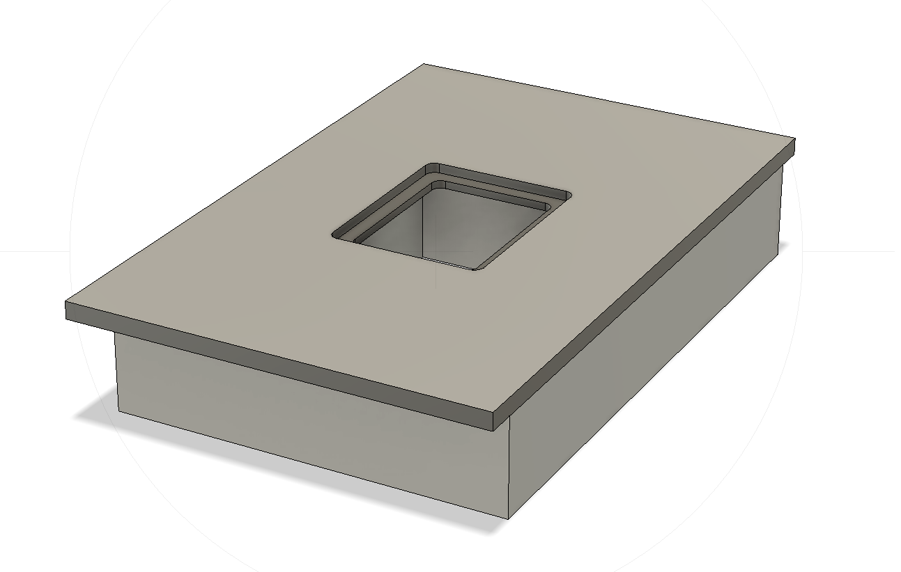
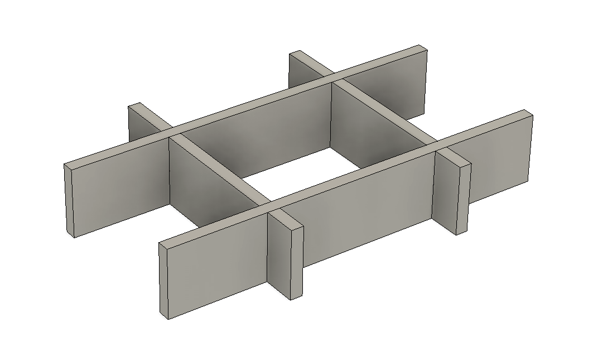
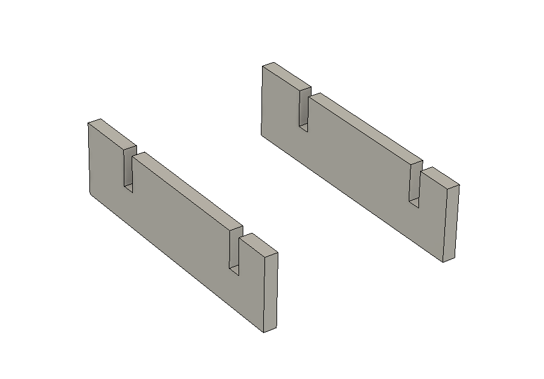
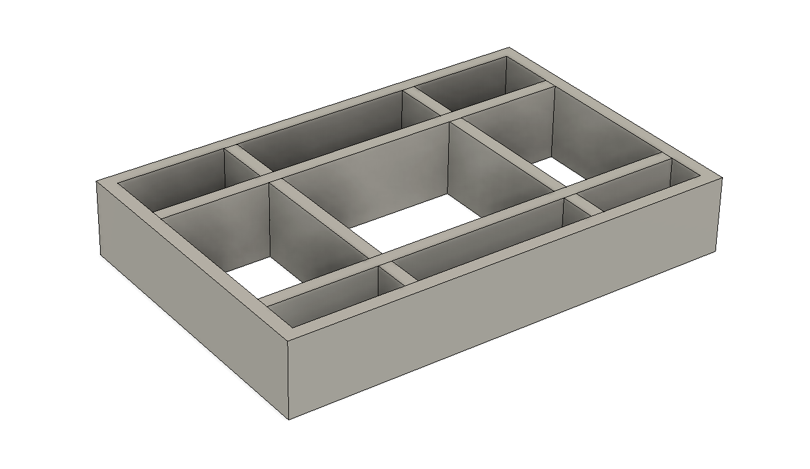
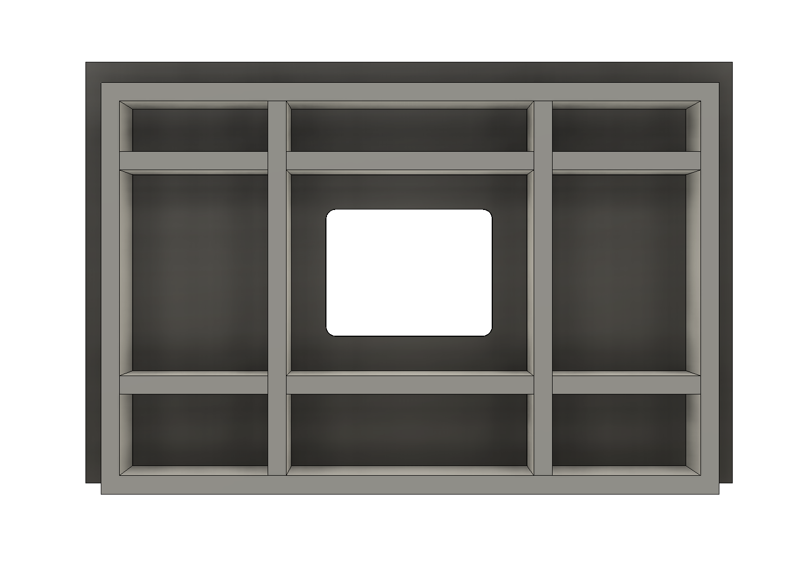

# Ontwerp

Aan de hand van de uitgangspunten is gestart met een uitwerking in een model. Om het ontwerp aanpasbaar te maken is rekening gehouden met enkele parameters.

## Model

Het model is opgezet met behulp van [Fusion 360](https://www.autodesk.com/products/fusion-360/personal){:target="_blank"}. Nadat dit pakket geinstalleerd is kan het model [hier gedownload](assets/fusion360/Freestafel%20-%20v1%20v6.f3d) worden. Open dit model met Fusion 360 en je kunt met 'Modify -> Change Parameters' de parameters naar wens aanpassen.

## Parameters

- mod_* parameters kan men afstemmen op een eventuele module of onderstel.

| Parameter | Waarde (mm) | Omschrijving |
| ----------| ----------- | -------------|
| mod_breedte | 600 | Breedte (buitenmaat) van module/onderstel |
| mod_diepte | 400 | Diepte (buitenmaat) van module/onderstel |
| mod_hoogte | 100 | Hoogte van module/onderstel |
| blad_overstek | 30 | Overstek van blad buiten module/onderstel |
| blad_dikte | 18 | Totale dikte van het blad. Blad kan in 2 delen gestapeld (verlijmt) zijn |
| torsionbox_dikte | 18 | Dikte van plaatmateriaal torsion box |
| torsionbox_hoogte | 100 | Hoogte van torsion box |
| inlegplaat_breedte | 200 | Buitenmaat breedte inlegplaat |
| inlegplaat_diepte | 160 | Buitenmaat diepte inlegplaat |
| inlegplaat_dikte | 10 | Dikte inlegplaat |
| inlegplaat_hoekradius | 10 | Radius van de hoek van de inlegplaat |
| inlegplaat_center_offset | 215 | Afstand van middelpunt frees tot voorkant blad  |

## Blad en torsion box

